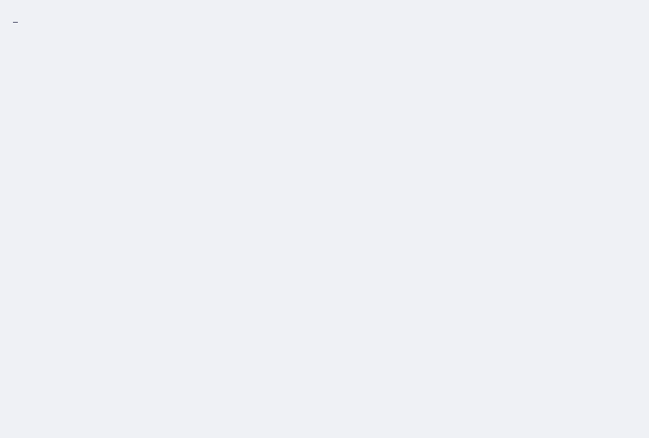

<!-- TERMINAL:START -->

<a href="https://aiza-gazyani.vercel.app/">
<picture>
  <source media="(prefers-color-scheme: dark)" srcset="output-dark.gif">
   fetch.sh -u Aiza166 : final-year CS student at FAST NUCES, Karachi. Builds LLM-powered tools end to end.">
</picture>
</a>

<!-- TERMINAL:END -->

🖥️ I'm **Aiza**, a final-year CS student at FAST NUCES, Karachi. I build LLM-powered tools end to end, from the database through to the browser, and I like the layers underneath: a Linux kernel module, [a compiler and VM for a pixel-art language](https://github.com/Aiza166/PixelForge-Compiler), and [an ML pipeline I audited until the honest number came out](https://github.com/Aiza166/NeuroDetect).

🌱 Lately: built the AI analyst at **AlphaVenture**, a chat over 5,998 Y Combinator startups where an MCP server is the model's only path to the database. Before that, my part of [Baymax](https://github.com/Aiza166/baymax.app), a team-built career copilot in which a constraint solver validates the 90-day plan before the LLM writes it up.

📍 Karachi · chess, graphic design, cycling.

<a href="https://aiza-gazyani.vercel.app/"><code>[ site ]</code></a> · <a href="mailto:aizagazyani16@gmail.com"><code>[ email ]</code></a> · <a href="https://www.linkedin.com/in/aiza-gazyani/"><code>[ linkedin ]</code></a> · <a href="https://drive.google.com/file/d/1mMadEwz5CTcw6OPjF4S7lOBRSDro6GJ7/view?usp=sharing"><code>[ resume ]</code></a> · <a href="https://leetcode.com/u/aizagazyani16/"><code>[ leetcode ]</code></a>

Tip: run `gh repo list Aiza166 --limit 10` to browse my repositories from your own terminal.

<i>Terminal rendered daily with <a href="https://github.com/x0rzavi/github-readme-terminal">github-readme-terminal</a> · <!-- STAMP -->last rendered 19 Sep 2026, 09:48 PKT<!-- /STAMP --></i>
